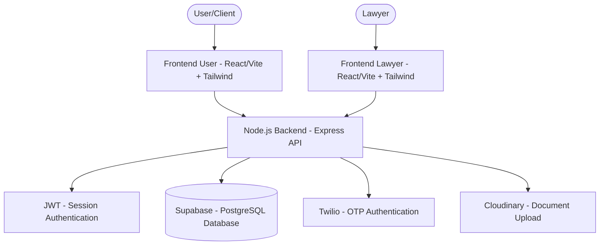
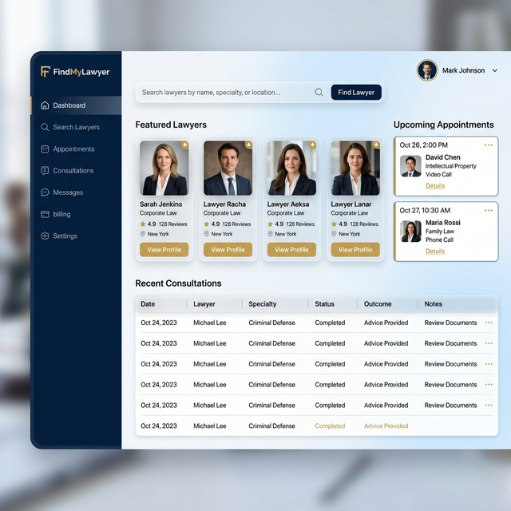

# FindMyLawyer ⚖️
### A Legal Consultation Platform Connecting Clients with Verified Lawyers


---

## 1. Project Overview
FindMyLawyer simplifies the process of finding and consulting with legal experts. Clients can browse lawyer profiles, submit consultation requests, and track their cases, while lawyers benefit from a dedicated dashboard to manage their practice, verify credentials, and handle client requests.

## 2. Features
- **Dual User Portals**: Personalized interfaces for both Clients and Lawyers.
- **Secure Authentication**: OTP-based login (Twilio) and JWT session management.
- **Lawyer Verification**: Certificate upload and verification system (Cloudinary).
- **Consultation Management**: Real-time request tracking and history.
- **Simulated Payments**: Integrated payment simulation for consultation bookings.
- **Admin Oversight**: Comprehensive admin dashboard for platform management.

## 3. Architecture
The project follows a modular architecture separating User and Lawyer concerns for maximum scalability.

### System Flow


### Deployment Architecture
```text
Internet
   │
   ▼
Nginx Reverse Proxy
   │
   ▼
Node.js Backend (PM2)
   │
   ▼
Supabase Database
```

> [!TIP]
> For a more detailed breakdown, see [docs/architecture.md](docs/architecture.md).

## 4. Tech Stack
- **Frontend**: React 19, Vite, Tailwind CSS, Lucide React.
- **Backend**: Node.js, Express, JWT Authentication.
- **Database**: Supabase (PostgreSQL).
- **Services**: Twilio (OTP Verification), Cloudinary (Media Storage).
- **Deployment**: Google Cloud Platform (GCP), Nginx, PM2.

## 5. Project Structure
FindMyLawyer is organized as a monorepo for easier management across all layers:

```text
FindMyLawyer
│
├── frontend-user        # Client-facing web application
├── frontend-lawyer      # Lawyer dashboard and management
├── backend              # User-side API services
├── backend-lawyer       # Lawyer-specific logic and integrations
├── docs                 # Detailed documentation (Architecture, API, Security)
├── .env.example         # Environment variables template
└── README.md            # Project entry point
```

## 6. Screenshots

### Landing Page


### User Dashboard


### Lawyer Dashboard


## 7. Requirements
- Node.js >= 18
- npm >= 9
- Git
- Google Cloud VM (Ubuntu 22.04 recommended)

## 8. Local Development
Follow these steps to get the project running locally:

### Step 1: Clone the Repository
```bash
git clone https://github.com/raziquehasan/FindMyLawyer.git
cd FindMyLawyer
```

### Step 2: Setup Backends
```bash
# In backend
cd backend && npm install && npm run dev

# In backend-lawyer
cd ../backend-lawyer && npm install && npm run dev
```

### Step 3: Setup Frontends
```bash
# In frontend-user
cd ../frontend-user && npm install && npm run dev

# In frontend-lawyer
cd ../frontend-lawyer && npm install && npm run dev
```

## 9. Environment Variables
Authentication and external services require specific environment keys. 

1. Create a `.env` file in each module's directory.
2. Use [.env.example](.env.example) as a guide for required variables.

⚠️ **IMPORTANT**: Never commit `.env` files to GitHub.

## 10. Deployment (GCP)
The platform is optimized for deployment on Google Cloud Platform.
- **Compute Engine**: Ubuntu VM instances.
- **Reverse Proxy**: Nginx for traffic routing.
- **Process Manager**: PM2 for backend persistence.

> [!NOTE]
> See the full [Deployment Guide](docs/deployment.md) for step-by-step GCP instructions.

## 11. Security
- **JWT Authentication** for all private API routes.
- **Role-Based Access Control (RBAC)** ensured at the API layer.
- **OTP Verification** using Twilio for secure logins.
- **Secure Storage** via Supabase and Cloudinary.

More details in [docs/security.md](docs/security.md).

## 12. API Overview
| Module | Base URL | Documentation |
|--------|----------|---------------|
| User API | `/api/user` | [api.md](docs/api.md) |
| Lawyer API | `/api/lawyer` | [api.md](docs/api.md) |

## 13. Maintainers
- Razique Hasan
- Darshan Solanki
- Development Team

## 14. Contribution Guide
1. **Branching**: `main` (production), `dev` (feature testing).
2. **Features**: Use `feature/your-feature-name` branch.
3. **Pull Requests**: Ensure tests pass and code is linted before submitting.

## 15. Future Roadmap
- [ ] AI-Powered Lawyer Recommendation Engine.
- [ ] Integrated Video Consultation System.
- [ ] Legal Document Auto-Generator.
- [ ] Advanced Rating and Review Analytics.
- [ ] Full Stripe/Razorpay Payment Integration.

## 16. License
This project is currently private and developed for internal use.

---

Built with ❤️ for the Legal Community.
