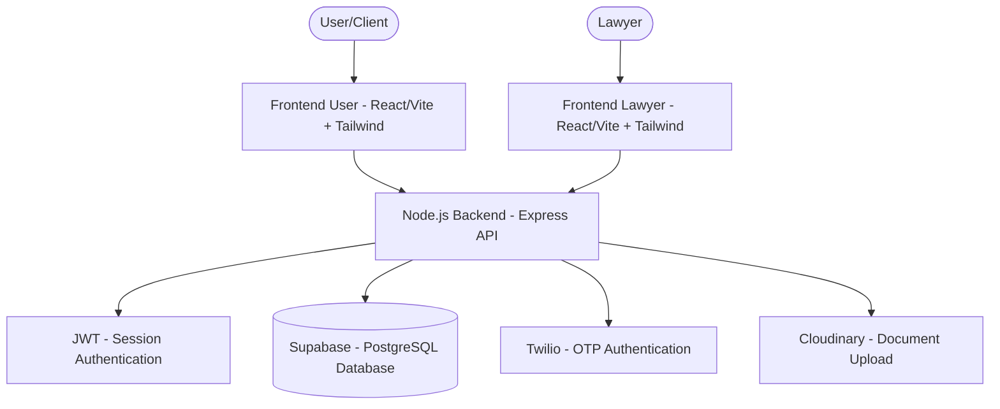

# System Architecture

FindMyLawyer is a comprehensive legal services platform built with a modern micro-services-inspired architecture. It separates concerns between clients (users) and legal professionals (lawyers) while maintaining a unified backend ecosystem.

## High-Level Architecture

## Component Breakdown

### 1. Frontend Layers
- **Frontend User**: A React + Vite application focused on client onboarding, lawyer search, and consultation requests. Uses Tailwind CSS for premium UI.
- **Frontend Lawyer**: A dedicated dashboard for legal professionals to manage certificates, view consultation requests, and handle case details. Integrated with Supabase for data synchronization.

### 2. Backend API Layers
- **Backend (User)**: Node.js/Express server handling core business logic for clients, including request submissions, payment simulation, and case tracking.
- **Backend Lawyer**: A specialized API layer for lawyer-specific workflows, including certificate verification via Cloudinary and OTP-based authentication via Twilio.

### 3. Data & Storage
- **Supabase**: Primary database (PostgreSQL) and authentication provider, ensuring real-time data synchronization.
- **Cloudinary**: Handles secure storage and optimization of legal documents and certificates.

### 4. External Services
- **Twilio**: Ensures secure access through SMS-based OTP verification.
- **JWT**: Industry-standard method for secure session handling across all modules.
- **Nginx (Deployment only)**: Acts as a reverse proxy, handling SSL termination and routing traffic to the appropriate backend/frontend modules.
